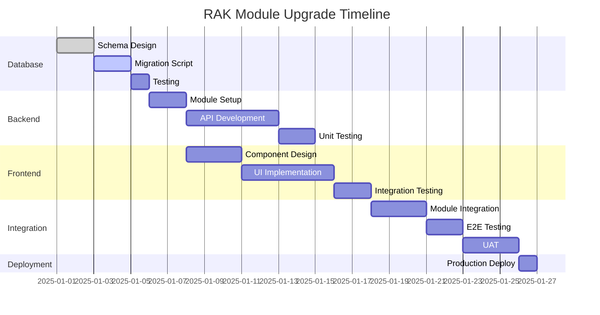

# 📊 RAK Module Upgrade - Overview

## 🎯 Tujuan Upgrade

Upgrade **MODULE 2: Anggaran Kas** menjadi **MODULE 2: RAK & Cash Flow Planning** untuk mendukung:

1. ✅ **RAK Detail per Subkegiatan** - Sesuai regulasi Permendagri 13/2006 & 77/2020
2. ✅ **Rincian per Kode Rekening** - Breakdown anggaran yang lebih granular
3. ✅ **Proyeksi Bulanan (12 bulan)** - Planning cash flow yang akurat
4. ✅ **SIPD-Compliant Export** - Format sesuai standar SIPD Kemendagri
5. ✅ **Approval Workflow** - Mekanisme persetujuan RAK

---

## 🔄 Perubahan Fundamental

### **BEFORE (v3):**
```
MODULE 2: Anggaran Kas
└── Cash Flow Projection (Agregat Level)
    ├── Total Penerimaan Bulanan
    ├── Total Pengeluaran Bulanan
    └── Saldo Kas
```

### **AFTER (v4 - OPTION 1):**
```
MODULE 2: RAK & Cash Flow Planning
├── RAK Detail (NEW - Micro Level)
│   ├── Per Subkegiatan
│   ├── Per Kode Rekening
│   ├── Breakdown 12 Bulan
│   ├── Approval Workflow
│   └── Export SIPD Format
│
└── Cash Flow Projection (EXISTING - Macro Level)
    ├── Auto-aggregate from RAK
    ├── Total Penerimaan Bulanan
    ├── Total Pengeluaran Bulanan
    ├── Saldo Kas
    └── Alert Defisit
```

---

## 📋 Struktur RAK yang Sebenarnya

```
HIERARKI ANGGARAN BLUD:
Program
  └── Kegiatan
       └── Subkegiatan
            └── RAK (Rencana Anggaran Kas)
                 ├── Kode Rekening 1
                 │   └── [Jan|Feb|Mar|...|Des]
                 ├── Kode Rekening 2
                 │   └── [Jan|Feb|Mar|...|Des]
                 └── Kode Rekening N
                     └── [Jan|Feb|Mar|...|Des]
```

### **Contoh RAK Form:**

```
RENCANA ANGGARAN KAS
Subkegiatan: Penyediaan Gaji dan Tunjangan ASN
Nilai Anggaran: Rp 48.849.967.174

┌──────────┬─────────────────────┬──────────────┬────────┬────────┬───────┬─────┐
│   Kode   │      Uraian         │   Anggaran   │  Jan   │  Feb   │  Mar  │ ... │
├──────────┼─────────────────────┼──────────────┼────────┼────────┼───────┼─────┤
│ 5.1.1.01 │ Belanja Gaji Pokok  │ 30.000.000K  │ 2.500K │ 2.500K │ 2.500K│ ... │
│ 5.1.1.02 │ Belanja Tunjangan   │ 18.000.000K  │ 1.500K │ 1.500K │ 1.500K│ ... │
│ 5.1.1.03 │ Honorarium          │    849.967K  │    70K │    70K │    70K│ ... │
└──────────┴─────────────────────┴──────────────┴────────┴────────┴───────┴─────┘
```

---

## 🎯 Scope Upgrade

### **1. Database Schema**
- ✅ Tabel baru: `rak_subkegiatan`
- ✅ Tabel baru: `rak_detail`
- ✅ View: `v_cash_flow_monthly` (aggregate)
- ✅ Indexes untuk performa
- ✅ Constraints & validations

### **2. Backend API (NestJS)**
- ✅ Module: `RakModule`
- ✅ Controller: `RakController`
- ✅ Service: `RakService`
- ✅ DTOs: Create/Update/Response
- ✅ 10+ new endpoints
- ✅ Approval workflow logic

### **3. Frontend UI (React + Vite)**
- ✅ RAK Detail View (Matrix Input)
- ✅ Cash Flow Summary View (Chart)
- ✅ Tab Navigation
- ✅ Form Validations
- ✅ Export functionality
- ✅ Approval UI

### **4. Integration**
- ✅ Link dengan RBA Management
- ✅ Link dengan Subkegiatan
- ✅ Link dengan Kode Rekening
- ✅ Link dengan Realisasi Belanja
- ✅ Export to SIPD format

---

## 📁 Dokumentasi yang Disediakan

1. **`01_RAK_MODULE_UPGRADE_OVERVIEW.md`** (this file)
   - Overview perubahan
   - Scope upgrade
   - Timeline

2. **`02_DATABASE_MIGRATION_GUIDE.md`**
   - DDL lengkap
   - Migration script
   - Sample data
   - Rollback plan

3. **`03_BACKEND_API_SPECIFICATION.md`**
   - NestJS module structure
   - API endpoints
   - DTOs & Entities
   - Service logic
   - Validations

4. **`04_FRONTEND_UI_GUIDE.md`**
   - Component structure
   - UI mockups
   - State management
   - Form handling
   - Export functionality

5. **`05_INTEGRATION_GUIDE.md`**
   - Integration dengan modules lain
   - Data flow
   - Business rules
   - Testing strategy

6. **`06_DEPLOYMENT_CHECKLIST.md`**
   - Pre-deployment steps
   - Migration sequence
   - Rollback procedure
   - Post-deployment validation

---

## ⏱️ Timeline Estimasi



**Total Durasi:** ~26 hari kerja (5-6 minggu)

---

## 👥 Team Requirements

| Role | Responsibility | Effort |
|------|---------------|--------|
| **Database Engineer** | Schema design, migration scripts | 3 hari |
| **Backend Developer** | NestJS module, API endpoints | 7 hari |
| **Frontend Developer** | React components, UI/UX | 8 hari |
| **QA Engineer** | Testing, validation | 5 hari |
| **DevOps** | Deployment, rollback plan | 2 hari |
| **BLUD Expert** | Requirement validation, UAT | 3 hari |

---

## ⚠️ Risk & Mitigation

| Risk | Impact | Mitigation |
|------|--------|------------|
| **Data Migration Error** | High | Complete backup, rollback script ready |
| **Performance Issue** | Medium | Proper indexing, query optimization |
| **UI/UX Complexity** | Medium | User testing, iterative feedback |
| **Integration Bug** | High | Comprehensive integration testing |
| **Regulatory Non-compliance** | Critical | BLUD expert validation, SIPD format testing |

---

## ✅ Success Criteria

1. ✅ RAK dapat dibuat per Subkegiatan dengan detail kode rekening
2. ✅ Breakdown bulanan (12 bulan) berfungsi dengan validasi
3. ✅ Auto-calculation semester & triwulan akurat
4. ✅ Approval workflow berjalan sesuai business rules
5. ✅ Export format SIPD sesuai standar Kemendagri
6. ✅ Cash flow projection tetap berfungsi (backward compatible)
7. ✅ Performance: RAK matrix load < 2 detik
8. ✅ Zero data loss pada migration
9. ✅ UAT passed oleh BLUD expert
10. ✅ Documentation lengkap & up-to-date

---

## 📞 Kontak & Support

- **Project Manager:** [Nama PM]
- **Tech Lead:** [Nama Tech Lead]
- **BLUD Expert:** [Nama Expert]
- **Repository:** https://github.com/rsds-dev/si-kancil
- **Documentation:** /docs/rak-module-upgrade/

---

## 📚 Referensi Regulasi

1. **Permendagri No. 13 Tahun 2006** - Pedoman Pengelolaan Keuangan Daerah
2. **Permendagri No. 77 Tahun 2020** - Pedoman Teknis Pengelolaan Keuangan Daerah
3. **PMK No. 220 Tahun 2016** - Pedoman Pengelolaan BLU
4. **Permendagri No. 79 Tahun 2018** - BLUD

---

**Last Updated:** 2025-02-17  
**Version:** 1.0  
**Status:** ✅ APPROVED FOR IMPLEMENTATION
