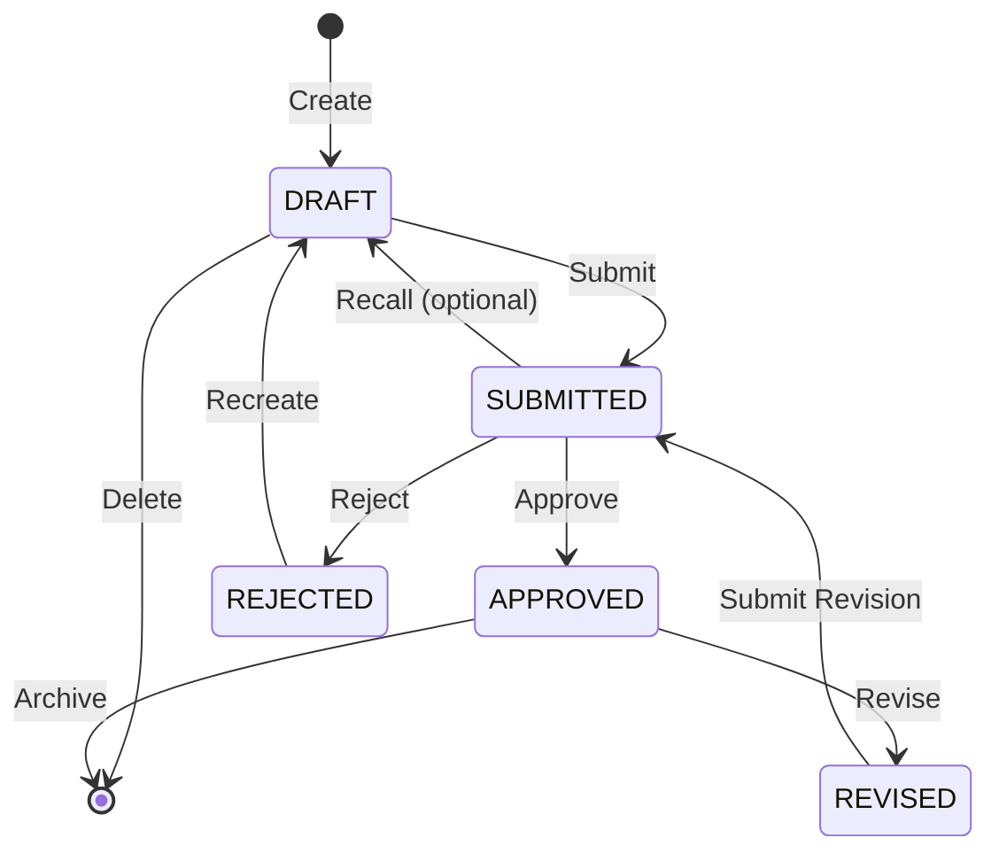

# 💼 Business Logic & Rules - RAK Module

## 📋 Overview

Dokumen ini menjelaskan **business logic** lengkap untuk RAK (Rencana Anggaran Kas) Module, termasuk business rules, validation rules, calculation formulas, workflow logic, dan edge cases handling.

---

## 🎯 Core Business Concept

### **Apa itu RAK?**

**RAK (Rencana Anggaran Kas)** adalah dokumen perencanaan keuangan yang merinci **kapan** dan **berapa** anggaran akan digunakan untuk setiap Subkegiatan dalam satu tahun anggaran.

**Fungsi Utama:**
1. 📅 **Cash Flow Planning** - Merencanakan arus kas bulanan
2. 💰 **Budget Control** - Mengontrol pencairan anggaran
3. 📊 **Monitoring** - Membandingkan rencana vs realisasi
4. ✅ **Compliance** - Memenuhi regulasi SIPD Kemendagri

---

## 🏗️ Hierarki & Struktur

### **Level 1: Hierarki Anggaran**

```
RBA (Rencana Bisnis dan Anggaran)
  └── Program
       └── Kegiatan
            └── Subkegiatan
                 └── RAK ← KITA DI SINI
                      └── Kode Rekening
                           └── Breakdown 12 Bulan
```

**Business Rule BR-001:**
> RAK hanya dapat dibuat untuk Subkegiatan yang sudah memiliki pagu anggaran di RBA yang telah approved.

**Contoh:**
```
❌ SALAH:
   RBA status: DRAFT → Tidak bisa buat RAK

✅ BENAR:
   RBA status: APPROVED → Bisa buat RAK
```

---

### **Level 2: Struktur RAK**

```
RAK Header (rak_subkegiatan)
├── Subkegiatan: "Penyediaan Gaji dan Tunjangan ASN"
├── Tahun: 2025
├── Total Pagu: Rp 48.000.000.000
├── Status: DRAFT
└── Details (rak_detail):
    ├── Detail 1:
    │   ├── Kode Rekening: 5.1.1.01 (Gaji Pokok)
    │   ├── Anggaran: Rp 30.000.000.000
    │   └── Bulanan:
    │       ├── Januari: Rp 2.500.000.000
    │       ├── Februari: Rp 2.500.000.000
    │       ├── ... (10 bulan lainnya)
    │       └── Desember: Rp 2.500.000.000
    └── Detail 2:
        ├── Kode Rekening: 5.1.1.02 (Tunjangan)
        ├── Anggaran: Rp 18.000.000.000
        └── Bulanan: [...]
```

---

## 📏 Business Rules

### **BR-001: Prerequisite RBA**

**Rule:**
```
RAK dapat dibuat HANYA JIKA:
  1. RBA untuk tahun tersebut sudah APPROVED
  2. Subkegiatan sudah memiliki pagu > 0
  3. DPA sudah diterbitkan (optional, tergantung kebijakan)
```

**Validation:**
```typescript
async validateRBAPrerequisite(subkegiatanId: string, tahun: number) {
  // 1. Check RBA status
  const rba = await this.rbaService.findByTahun(tahun);
  if (rba.status !== 'APPROVED') {
    throw new BusinessRuleException(
      'BR-001',
      'RBA belum approved. RAK hanya bisa dibuat setelah RBA disetujui.'
    );
  }
  
  // 2. Check subkegiatan pagu
  const subkegiatan = await this.subkegiatanService.findOne(subkegiatanId);
  if (subkegiatan.pagu <= 0) {
    throw new BusinessRuleException(
      'BR-001',
      'Subkegiatan tidak memiliki pagu anggaran.'
    );
  }
  
  return true;
}
```

---

### **BR-002: Uniqueness Per Tahun**

**Rule:**
```
Satu Subkegiatan hanya boleh memiliki SATU RAK aktif per tahun anggaran.
(Kecuali status REJECTED, yang bisa di-recreate)
```

**Validation:**
```typescript
async validateUniqueness(subkegiatanId: string, tahun: number) {
  const existing = await this.rakRepo.findOne({
    where: {
      subkegiatan_id: subkegiatanId,
      tahun_anggaran: tahun,
      status: Not(In(['REJECTED'])), // Ignore rejected ones
      deleted_at: IsNull(),
    },
  });
  
  if (existing) {
    throw new BusinessRuleException(
      'BR-002',
      `RAK untuk subkegiatan ini di tahun ${tahun} sudah ada dengan status ${existing.status}.`
    );
  }
  
  return true;
}
```

**Edge Case:**
```
Q: Bagaimana jika RAK REJECTED?
A: User bisa create RAK baru untuk tahun yang sama.

Q: Bagaimana jika ada revisi?
A: Gunakan fitur "Revise" yang akan create revision baru dengan 
   revision_number++ dan link ke previous_version_id.
```

---

### **BR-003: Total Pagu Constraint**

**Rule:**
```
rak.total_pagu <= subkegiatan.pagu
```

**Validation:**
```typescript
async validateTotalPagu(subkegiatanId: string, totalPagu: number) {
  const subkegiatan = await this.subkegiatanService.findOne(subkegiatanId);
  
  if (totalPagu > subkegiatan.pagu) {
    throw new BusinessRuleException(
      'BR-003',
      `Total pagu RAK (${formatCurrency(totalPagu)}) melebihi pagu subkegiatan (${formatCurrency(subkegiatan.pagu)}).`
    );
  }
  
  // Warning jika kurang dari pagu (mungkin ada sisa)
  if (totalPagu < subkegiatan.pagu) {
    this.logger.warn(
      `RAK total pagu (${totalPagu}) kurang dari pagu subkegiatan (${subkegiatan.pagu}). Selisih: ${subkegiatan.pagu - totalPagu}`
    );
  }
  
  return true;
}
```

**Business Decision:**
```
Q: Bolehkah RAK.total_pagu < subkegiatan.pagu?
A: Ya, boleh. Artinya ada anggaran yang tidak direncanakan di RAK.
   Ini akan menjadi "sisa anggaran" yang bisa digunakan untuk 
   kebutuhan mendesak (dengan approval khusus).

Q: Apakah ada threshold maksimal selisih?
A: Tidak ada di regulasi, tapi best practice: <= 5% dari pagu.
```

---

### **BR-004: Detail Balance Constraint**

**Rule:**
```
SUM(rak_detail.jumlah_anggaran) = rak_subkegiatan.total_pagu
```

**Validation:**
```typescript
async validateDetailBalance(rakId: string) {
  const rak = await this.rakRepo.findOne({ 
    where: { id: rakId },
    relations: ['details'],
  });
  
  const totalDetail = rak.details.reduce(
    (sum, detail) => sum + parseFloat(detail.jumlah_anggaran.toString()), 
    0
  );
  
  const totalPagu = parseFloat(rak.total_pagu.toString());
  
  // Allow 0.01 tolerance for rounding
  if (Math.abs(totalDetail - totalPagu) > 0.01) {
    throw new BusinessRuleException(
      'BR-004',
      `Total detail (${formatCurrency(totalDetail)}) tidak sama dengan total pagu (${formatCurrency(totalPagu)}). Selisih: ${formatCurrency(Math.abs(totalDetail - totalPagu))}`
    );
  }
  
  return true;
}
```

**Database Constraint:**
```sql
-- Trigger untuk auto-validate sebelum submit
CREATE TRIGGER trigger_validate_detail_balance
BEFORE UPDATE ON rak_subkegiatan
FOR EACH ROW
WHEN (NEW.status = 'SUBMITTED' AND OLD.status != 'SUBMITTED')
EXECUTE FUNCTION validate_detail_balance();
```

---

### **BR-005: Monthly Balance Constraint**

**Rule:**
```
Untuk setiap rak_detail:
SUM(januari + februari + ... + desember) = jumlah_anggaran
```

**Validation:**
```typescript
async validateMonthlyBalance(detail: RakDetail) {
  const months: (keyof MonthlyBreakdown)[] = [
    'januari', 'februari', 'maret', 'april', 'mei', 'juni',
    'juli', 'agustus', 'september', 'oktober', 'november', 'desember',
  ];
  
  const monthlyTotal = months.reduce(
    (sum, month) => sum + parseFloat(detail[month]?.toString() || '0'),
    0
  );
  
  const anggaran = parseFloat(detail.jumlah_anggaran.toString());
  
  if (Math.abs(monthlyTotal - anggaran) > 0.01) {
    throw new BusinessRuleException(
      'BR-005',
      `Total bulanan (${formatCurrency(monthlyTotal)}) tidak sama dengan anggaran (${formatCurrency(anggaran)}) untuk kode rekening ${detail.kode_rekening.kode}.`
    );
  }
  
  return true;
}
```

**Database Constraint:**
```sql
-- Check constraint
CONSTRAINT rak_detail_balance_check CHECK (
  ABS(jumlah_anggaran - (
    COALESCE(januari,0) + COALESCE(februari,0) + COALESCE(maret,0) + 
    COALESCE(april,0) + COALESCE(mei,0) + COALESCE(juni,0) +
    COALESCE(juli,0) + COALESCE(agustus,0) + COALESCE(september,0) + 
    COALESCE(oktober,0) + COALESCE(november,0) + COALESCE(desember,0)
  )) < 0.01
)
```

---

### **BR-006: Kode Rekening Restriction**

**Rule:**
```
Hanya kode rekening BELANJA (level 6) yang boleh digunakan di RAK.
Kode harus dimulai dengan "5." (Belanja)
```

**Validation:**
```typescript
async validateKodeRekening(kodeRekeningId: string) {
  const kode = await this.kodeRekeningService.findOne(kodeRekeningId);
  
  // 1. Check level
  if (kode.level !== 6) {
    throw new BusinessRuleException(
      'BR-006',
      `Hanya kode rekening level 6 (detail) yang bisa digunakan. Kode ${kode.kode} adalah level ${kode.level}.`
    );
  }
  
  // 2. Check tipe (must be Belanja)
  if (!kode.kode.startsWith('5.')) {
    throw new BusinessRuleException(
      'BR-006',
      `Hanya kode rekening Belanja (5.x.x.x) yang bisa digunakan di RAK. Kode ${kode.kode} bukan kode belanja.`
    );
  }
  
  // 3. Check active
  if (kode.deleted_at) {
    throw new BusinessRuleException(
      'BR-006',
      `Kode rekening ${kode.kode} tidak aktif.`
    );
  }
  
  return true;
}
```

**Allowed Kode Rekening:**
```
✅ 5.1.1.01 - Belanja Gaji Pokok PNS
✅ 5.1.2.01 - Belanja Barang Operasional
✅ 5.2.1.01 - Belanja Modal Tanah
❌ 4.1.1.01 - Pendapatan Asli Daerah (bukan belanja)
❌ 5.1.1 - Belanja Pegawai (bukan level 6)
```

---

### **BR-007: Non-Negative Values**

**Rule:**
```
Semua nilai anggaran harus >= 0 (tidak boleh negatif)
```

**Validation:**
```typescript
async validateNonNegative(detail: CreateRakDetailDto) {
  const months = [
    'januari', 'februari', 'maret', 'april', 'mei', 'juni',
    'juli', 'agustus', 'september', 'oktober', 'november', 'desember',
  ];
  
  // Check jumlah_anggaran
  if (detail.jumlah_anggaran < 0) {
    throw new BusinessRuleException(
      'BR-007',
      'Jumlah anggaran tidak boleh negatif.'
    );
  }
  
  // Check each month
  for (const month of months) {
    if (detail[month] && detail[month] < 0) {
      throw new BusinessRuleException(
        'BR-007',
        `Nilai untuk ${month} tidak boleh negatif.`
      );
    }
  }
  
  return true;
}
```

---

### **BR-008: Duplicate Kode Rekening**

**Rule:**
```
Dalam satu RAK, tidak boleh ada kode rekening yang sama (duplikat)
```

**Validation:**
```typescript
async validateNoDuplicateKodeRekening(
  rakId: string, 
  kodeRekeningId: string
) {
  const existing = await this.rakDetailRepo.findOne({
    where: {
      rak_subkegiatan_id: rakId,
      kode_rekening_id: kodeRekeningId,
    },
  });
  
  if (existing) {
    throw new BusinessRuleException(
      'BR-008',
      `Kode rekening ini sudah ada di RAK ini.`
    );
  }
  
  return true;
}
```

**Database Constraint:**
```sql
-- Unique constraint
CONSTRAINT rak_detail_unique 
  UNIQUE(rak_subkegiatan_id, kode_rekening_id)
```

---

## 🔄 Workflow Logic

### **State Machine**



---

### **WF-001: Create (DRAFT)**

**Actors:** PPTK, Admin Keuangan

**Preconditions:**
- User has role PPTK or ADMIN_KEUANGAN
- RBA untuk tahun tersebut sudah APPROVED
- Subkegiatan memiliki pagu > 0

**Process:**
```typescript
async create(createRakDto: CreateRakDto, userId: string) {
  // 1. Validate prerequisites
  await this.validateRBAPrerequisite(
    createRakDto.subkegiatan_id, 
    createRakDto.tahun_anggaran
  );
  
  // 2. Validate uniqueness
  await this.validateUniqueness(
    createRakDto.subkegiatan_id, 
    createRakDto.tahun_anggaran
  );
  
  // 3. Validate total pagu
  await this.validateTotalPagu(
    createRakDto.subkegiatan_id, 
    createRakDto.total_pagu
  );
  
  // 4. Create RAK header
  const rak = await this.rakRepo.save({
    ...createRakDto,
    status: 'DRAFT',
    created_by: userId,
  });
  
  // 5. Create details if provided
  if (createRakDto.details) {
    for (const detail of createRakDto.details) {
      await this.validateKodeRekening(detail.kode_rekening_id);
      await this.validateNonNegative(detail);
      await this.validateMonthlyBalance(detail);
      
      await this.rakDetailRepo.save({
        ...detail,
        rak_subkegiatan_id: rak.id,
        created_by: userId,
      });
    }
  }
  
  return rak;
}
```

**Business Rules Applied:**
- BR-001 (RBA Prerequisite)
- BR-002 (Uniqueness)
- BR-003 (Total Pagu)
- BR-006 (Kode Rekening)
- BR-007 (Non-Negative)
- BR-005 (Monthly Balance) for each detail

---

### **WF-002: Submit (DRAFT → SUBMITTED)**

**Actors:** PPTK

**Preconditions:**
- RAK status = DRAFT
- User is creator OR user has role PPTK
- All validations passed

**Process:**
```typescript
async submit(rakId: string, userId: string) {
  const rak = await this.findOne(rakId);
  
  // 1. Check status
  if (rak.status !== 'DRAFT') {
    throw new WorkflowException(
      'WF-002',
      `Hanya RAK berstatus DRAFT yang bisa disubmit. Status saat ini: ${rak.status}`
    );
  }
  
  // 2. Check permission
  if (rak.created_by !== userId && !this.userHasRole(userId, 'PPTK')) {
    throw new UnauthorizedException('Hanya creator atau PPTK yang bisa submit RAK.');
  }
  
  // 3. Validate completeness
  if (!rak.details || rak.details.length === 0) {
    throw new BusinessRuleException(
      'BR-009',
      'RAK harus memiliki minimal 1 detail kode rekening.'
    );
  }
  
  // 4. Validate detail balance
  await this.validateDetailBalance(rakId);
  
  // 5. Update status
  await this.rakRepo.update(rakId, {
    status: 'SUBMITTED',
    submitted_at: new Date(),
    submitted_by: userId,
  });
  
  // 6. Send notification to Verifikator
  await this.notificationService.send({
    to: this.getUsersByRole('VERIFIKATOR'),
    subject: 'RAK Baru Menunggu Approval',
    body: `RAK ${rak.subkegiatan.nama} - ${rak.tahun_anggaran} telah disubmit.`,
    link: `/rak/${rakId}`,
  });
  
  return this.findOne(rakId);
}
```

**Business Rules Applied:**
- BR-004 (Detail Balance)
- BR-009 (Minimal 1 detail) - NEW

---

### **WF-003: Approve (SUBMITTED → APPROVED)**

**Actors:** Verifikator, Admin Keuangan, PPKD

**Preconditions:**
- RAK status = SUBMITTED
- User has role VERIFIKATOR, ADMIN_KEUANGAN, or PPKD

**Process:**
```typescript
async approve(rakId: string, userId: string, notes?: string) {
  const rak = await this.findOne(rakId);
  
  // 1. Check status
  if (rak.status !== 'SUBMITTED') {
    throw new WorkflowException(
      'WF-003',
      `Hanya RAK berstatus SUBMITTED yang bisa diapprove. Status saat ini: ${rak.status}`
    );
  }
  
  // 2. Check permission
  const allowedRoles = ['VERIFIKATOR', 'ADMIN_KEUANGAN', 'PPKD'];
  if (!this.userHasAnyRole(userId, allowedRoles)) {
    throw new UnauthorizedException('Tidak memiliki permission untuk approve RAK.');
  }
  
  // 3. Business validation (final check)
  await this.validateDetailBalance(rakId);
  
  // 4. Update status
  await this.rakRepo.update(rakId, {
    status: 'APPROVED',
    approved_at: new Date(),
    approved_by: userId,
    approval_notes: notes,
  });
  
  // 5. Set flag di Subkegiatan
  await this.subkegiatanRepo.update(rak.subkegiatan_id, {
    rak_approved: true,
    rak_approved_at: new Date(),
  });
  
  // 6. Send notification to creator
  await this.notificationService.send({
    to: [rak.created_by],
    subject: 'RAK Disetujui',
    body: `RAK ${rak.subkegiatan.nama} - ${rak.tahun_anggaran} telah disetujui.`,
    link: `/rak/${rakId}`,
  });
  
  // 7. Emit event for other modules
  this.eventEmitter.emit('rak.approved', {
    rakId,
    subkegiatanId: rak.subkegiatan_id,
    tahun: rak.tahun_anggaran,
  });
  
  return this.findOne(rakId);
}
```

**Post-Approval Effects:**
- Subkegiatan flag `rak_approved = true`
- SPP/SPM module dapat create pencairan
- Cash flow projection terupdate
- Event emitted untuk modules lain

---

### **WF-004: Reject (SUBMITTED → REJECTED)**

**Actors:** Verifikator, Admin Keuangan, PPKD

**Preconditions:**
- RAK status = SUBMITTED
- Rejection reason provided (mandatory)

**Process:**
```typescript
async reject(rakId: string, userId: string, reason: string) {
  const rak = await this.findOne(rakId);
  
  // 1. Check status
  if (rak.status !== 'SUBMITTED') {
    throw new WorkflowException(
      'WF-004',
      `Hanya RAK berstatus SUBMITTED yang bisa direject.`
    );
  }
  
  // 2. Check reason
  if (!reason || reason.trim().length === 0) {
    throw new BusinessRuleException(
      'BR-010',
      'Alasan penolakan harus diisi.'
    );
  }
  
  // 3. Update status
  await this.rakRepo.update(rakId, {
    status: 'REJECTED',
    rejected_at: new Date(),
    rejected_by: userId,
    rejection_reason: reason,
  });
  
  // 4. Send notification to creator
  await this.notificationService.send({
    to: [rak.created_by],
    subject: 'RAK Ditolak',
    body: `RAK ${rak.subkegiatan.nama} ditolak. Alasan: ${reason}`,
    link: `/rak/${rakId}`,
    priority: 'high',
  });
  
  return this.findOne(rakId);
}
```

**Business Rules Applied:**
- BR-010 (Rejection reason mandatory) - NEW

**After Rejection:**
- Creator dapat create RAK baru (BR-002 allows this)
- RAK yang rejected tetap tersimpan (soft delete only if needed)

---

### **WF-005: Revise (APPROVED → REVISED)**

**Actors:** PPTK

**Preconditions:**
- RAK status = APPROVED
- Revisi diperlukan karena perubahan kebutuhan

**Process:**
```typescript
async createRevision(rakId: string, userId: string) {
  const originalRak = await this.findOne(rakId);
  
  // 1. Check status
  if (originalRak.status !== 'APPROVED') {
    throw new WorkflowException(
      'WF-005',
      'Hanya RAK yang sudah APPROVED yang bisa direvisi.'
    );
  }
  
  // 2. Create new revision
  const revision = await this.rakRepo.save({
    subkegiatan_id: originalRak.subkegiatan_id,
    tahun_anggaran: originalRak.tahun_anggaran,
    total_pagu: originalRak.total_pagu, // Will be updated
    status: 'DRAFT',
    revision_number: originalRak.revision_number + 1,
    previous_version_id: originalRak.id,
    created_by: userId,
  });
  
  // 3. Copy details from original
  for (const detail of originalRak.details) {
    await this.rakDetailRepo.save({
      ...detail,
      id: undefined, // New ID
      rak_subkegiatan_id: revision.id,
      created_by: userId,
    });
  }
  
  // 4. Update original status
  await this.rakRepo.update(originalRak.id, {
    status: 'REVISED',
  });
  
  return this.findOne(revision.id);
}
```

**Revision Logic:**
- Original RAK status → REVISED (archived)
- New RAK created dengan revision_number++
- All details copied untuk editing
- Link maintained via previous_version_id

---

## 🧮 Calculation Logic

### **CALC-001: Auto-Calculate Semester**

```typescript
// Generated column in database
semester_1 = januari + februari + maret + april + mei + juni
semester_2 = juli + agustus + september + oktober + november + desember
```

**Usage:**
```sql
SELECT 
  kode_rekening,
  semester_1,
  semester_2,
  (semester_1 + semester_2) as total_tahun
FROM rak_detail
WHERE rak_subkegiatan_id = :rakId;
```

---

### **CALC-002: Auto-Calculate Triwulan**

```typescript
// Generated columns
triwulan_1 = januari + februari + maret
triwulan_2 = april + mei + juni
triwulan_3 = juli + agustus + september
triwulan_4 = oktober + november + desember
```

---

### **CALC-003: Cash Flow Projection**

**Formula:**
```
Saldo Akhir Bulan N = Saldo Awal Bulan N + Penerimaan N - Pengeluaran N
Saldo Awal Bulan N+1 = Saldo Akhir Bulan N
```

**Implementation:**
```typescript
calculateCashFlowProjection(tahun: number, saldoAwal: number = 0) {
  // Get aggregate RAK per month
  const rak = await this.db.query(`
    SELECT 
      SUM(januari) as jan, SUM(februari) as feb, ...
    FROM v_cash_flow_monthly
    WHERE tahun_anggaran = $1
  `, [tahun]);
  
  // Get penerimaan projection (from Pendapatan module)
  const penerimaan = await this.penerimaanService.getProjection(tahun);
  
  let runningBalance = saldoAwal;
  const cashFlow = [];
  
  const months = ['jan', 'feb', 'mar', ...];
  
  for (const month of months) {
    const pengeluaran = rak[month] || 0;
    const terima = penerimaan[month] || 0;
    
    runningBalance = runningBalance + terima - pengeluaran;
    
    cashFlow.push({
      month,
      penerimaan: terima,
      pengeluaran,
      balance: runningBalance,
      alert: runningBalance < 0 ? 'DEFICIT' : null,
    });
  }
  
  return cashFlow;
}
```

---

### **CALC-004: Variance Analysis**

**Formula:**
```
Variance = Realisasi - RAK
Variance % = (Realisasi / RAK) * 100
```

**Implementation:**
```typescript
calculateVariance(rakId: string, bulan: number) {
  const result = await this.db.query(`
    SELECT 
      kr.kode,
      rd.januari as rak_value,
      COALESCE(rb.januari, 0) as real_value,
      (COALESCE(rb.januari, 0) - rd.januari) as variance,
      CASE 
        WHEN rd.januari > 0 
        THEN (COALESCE(rb.januari, 0) / rd.januari * 100)
        ELSE 0 
      END as variance_pct
    FROM rak_detail rd
    JOIN kode_rekening kr ON rd.kode_rekening_id = kr.id
    LEFT JOIN realisasi_belanja rb ON 
      rb.kode_rekening_id = rd.kode_rekening_id
      AND rb.bulan = $2
    WHERE rd.rak_subkegiatan_id = $1
  `, [rakId, bulan]);
  
  return result.map(row => ({
    ...row,
    status: this.getVarianceStatus(row.variance_pct),
  }));
}

getVarianceStatus(percentage: number): string {
  if (percentage < 70) return 'UNDER'; // Under-spending
  if (percentage >= 70 && percentage < 90) return 'ON_TRACK';
  if (percentage >= 90 && percentage <= 100) return 'WARNING';
  if (percentage > 100) return 'OVER'; // Over-spending
  return 'UNKNOWN';
}
```

---

## 🚨 Edge Cases & Special Scenarios

### **EDGE-001: RAK dengan 0 Detail**

**Scenario:**
User create RAK header tapi belum input detail.

**Handling:**
```typescript
// Allow creation with 0 details (DRAFT)
// But prevent submission
async submit(rakId: string) {
  const rak = await this.findOne(rakId);
  
  if (!rak.details || rak.details.length === 0) {
    throw new BusinessRuleException(
      'BR-009',
      'RAK harus memiliki minimal 1 detail sebelum disubmit.'
    );
  }
  
  // Continue...
}
```

---

### **EDGE-002: Perubahan RBA Setelah RAK Approved**

**Scenario:**
RBA direvisi, pagu Subkegiatan berubah, tapi RAK sudah approved.

**Handling:**
```typescript
// Event listener in RBAService
async onRBARevised(rbaId: string) {
  const affectedRAK = await this.rakRepo.find({
    where: {
      subkegiatan_id: In(affectedSubkegiatanIds),
      status: 'APPROVED',
    },
  });
  
  for (const rak of affectedRAK) {
    // Create notification for review
    await this.notificationService.create({
      type: 'RAK_NEEDS_REVIEW',
      message: 'RBA telah direvisi. Silakan review dan buat revisi RAK jika diperlukan.',
      target: rak.id,
      users: [rak.created_by],
      priority: 'high',
    });
    
    // Optional: Auto-create flag
    await this.rakRepo.update(rak.id, {
      needs_review: true,
    });
  }
}
```

**Business Decision:**
- RAK tetap valid (tidak auto-rejected)
- Notification sent untuk review manual
- PPTK decide: perlu revisi atau tidak

---

### **EDGE-003: Rounding Issues**

**Scenario:**
```
Anggaran: 1.000.000
Dibagi 12 bulan: 83.333,33 per bulan
Total: 12 x 83.333,33 = 999.999,96 (kurang Rp 0,04)
```

**Handling:**
```typescript
autoDistribute(totalAnggaran: number): MonthlyBreakdown {
  const perMonth = Math.floor(totalAnggaran / 12);
  const remainder = totalAnggaran - (perMonth * 12);
  
  return {
    januari: perMonth + remainder, // Put remainder in first month
    februari: perMonth,
    maret: perMonth,
    // ... other months
    desember: perMonth,
  };
}
```

**Validation:**
```typescript
// Allow 0.01 tolerance
if (Math.abs(totalMonthly - jumlahAnggaran) > 0.01) {
  throw new ValidationException('Total tidak balance');
}
```

---

### **EDGE-004: Multi-Currency (Future)**

**Scenario:**
Mungkin ada hibah dalam USD yang perlu dikonversi.

**Current Handling:**
```typescript
// Currently: RAK only supports IDR
// All values stored as DECIMAL(15,2) in IDR

// Future: If multi-currency needed
interface RakDetailWithCurrency extends RakDetail {
  currency: 'IDR' | 'USD' | 'EUR';
  exchange_rate?: number;
  idr_equivalent: number; // Auto-calculated
}
```

**Business Decision:**
- Phase 1: IDR only
- Phase 2+: Support multi-currency if needed

---

### **EDGE-005: RAK untuk Tahun Berjalan (Mid-Year)**

**Scenario:**
Sudah Juli, tapi baru buat RAK tahun ini.

**Handling:**
```typescript
async create(createRakDto: CreateRakDto) {
  const now = new Date();
  const currentMonth = now.getMonth() + 1; // 1-12
  const tahun = createRakDto.tahun_anggaran;
  
  // Warning jika tahun berjalan dan sudah melewati Q1
  if (tahun === now.getFullYear() && currentMonth > 3) {
    this.logger.warn(
      `RAK dibuat untuk tahun berjalan di bulan ${currentMonth}. ` +
      `Bulan ${1} - ${currentMonth-1} mungkin sudah ada realisasi.`
    );
    
    // Optional: Auto-validate against existing realisasi
    const realisasi = await this.realisasiService.getBySubkegiatan(
      createRakDto.subkegiatan_id,
      tahun,
      1,
      currentMonth - 1
    );
    
    if (realisasi.total > 0) {
      // Suggest to input actual values for past months
      throw new BusinessRuleException(
        'BR-011',
        `Sudah ada realisasi sebesar ${formatCurrency(realisasi.total)} untuk periode Januari - ${this.getMonthName(currentMonth-1)}. RAK harus memperhitungkan realisasi yang sudah ada.`
      );
    }
  }
  
  // Continue normal creation...
}
```

---

## 📊 Reporting & Analytics

### **REPORT-001: RAK Summary per BLUD**

```sql
SELECT 
  rs.tahun_anggaran,
  COUNT(rs.id) as total_rak,
  COUNT(CASE WHEN rs.status = 'APPROVED' THEN 1 END) as approved,
  COUNT(CASE WHEN rs.status = 'SUBMITTED' THEN 1 END) as pending,
  COUNT(CASE WHEN rs.status = 'DRAFT' THEN 1 END) as draft,
  COUNT(CASE WHEN rs.status = 'REJECTED' THEN 1 END) as rejected,
  SUM(rs.total_pagu) as total_pagu
FROM rak_subkegiatan rs
WHERE rs.deleted_at IS NULL
GROUP BY rs.tahun_anggaran
ORDER BY rs.tahun_anggaran DESC;
```

---

### **REPORT-002: RAK vs Realisasi per Bulan**

```sql
SELECT 
  TO_CHAR(DATE_TRUNC('month', rb.tanggal), 'YYYY-MM') as bulan,
  SUM(rd.januari + rd.februari + ... ) as rak_total,
  SUM(rb.total) as realisasi_total,
  (SUM(rb.total) / SUM(rd.januari + ... ) * 100) as percentage
FROM rak_detail rd
JOIN rak_subkegiatan rs ON rd.rak_subkegiatan_id = rs.id
LEFT JOIN realisasi_belanja rb ON 
  rb.kode_rekening_id = rd.kode_rekening_id
  AND EXTRACT(YEAR FROM rb.tanggal) = rs.tahun_anggaran
WHERE rs.status = 'APPROVED'
GROUP BY bulan
ORDER BY bulan;
```

---

## ✅ Business Logic Checklist

### **Creation:**
- [ ] BR-001: RBA prerequisite validated
- [ ] BR-002: Uniqueness checked
- [ ] BR-003: Total pagu validated
- [ ] BR-006: Kode rekening validated
- [ ] BR-007: Non-negative values
- [ ] BR-008: No duplicate kode rekening

### **Submission:**
- [ ] BR-004: Detail balance validated
- [ ] BR-005: Monthly balance validated
- [ ] BR-009: Minimal 1 detail exists

### **Approval:**
- [ ] WF-003: Permission checked
- [ ] All business rules re-validated
- [ ] Subkegiatan flag updated
- [ ] Notifications sent

### **Calculations:**
- [ ] CALC-001: Semester auto-calculated
- [ ] CALC-002: Triwulan auto-calculated
- [ ] CALC-003: Cash flow projected
- [ ] CALC-004: Variance analyzed

---

**Business Logic Owner:** BLUD Expert + Tech Lead  
**Review Date:** 2025-02-17  
**Version:** 1.0  
**Status:** ✅ Ready for Implementation
