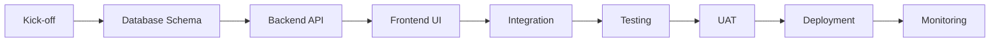

# 📚 RAK Module Upgrade Documentation

## 🎯 Overview

Dokumentasi lengkap untuk upgrade **MODULE 2: Anggaran Kas** menjadi **MODULE 2: RAK & Cash Flow Planning** pada sistem Si-Kancil (Sistem Keuangan Cepat Lincah) untuk BLUD.

**Upgrade Type:** OPTION 1 - Rename & Expand (Backward Compatible)

**Version:** 1.0  
**Date:** 2025-02-17  
**Status:** ✅ Ready for Implementation

---

## 📁 Dokumentasi yang Tersedia

### **1. [01_RAK_MODULE_UPGRADE_OVERVIEW.md](./01_RAK_MODULE_UPGRADE_OVERVIEW.md)**
**Untuk:** Project Manager, Tech Lead, Stakeholders

**Isi:**
- 📋 Overview perubahan dan scope upgrade
- 🔄 Perbandingan BEFORE vs AFTER
- 📊 Struktur RAK yang sebenarnya
- ⏱️ Timeline estimasi (5-6 minggu)
- 👥 Team requirements
- ⚠️ Risk & mitigation
- ✅ Success criteria

**Kapan dibaca:**
- Sebelum kick-off project
- Untuk presentasi ke stakeholders
- Untuk estimasi budget & resource

---

### **2. [02_DATABASE_MIGRATION_GUIDE.md](./02_DATABASE_MIGRATION_GUIDE.md)**
**Untuk:** Database Engineer, Backend Developer

**Isi:**
- 🗄️ ERD (Entity Relationship Diagram)
- 📝 DDL lengkap (CREATE TABLE, INDEX, VIEW, TRIGGER)
- 📊 Sample data untuk testing
- 🔄 Rollback procedure
- ✅ Post-migration validation queries

**Kapan dibaca:**
- Sebelum database migration
- Saat testing di development/staging
- Saat troubleshooting database issues

**File Penting:**
```
migrations/
├── 01_create_rak_tables.sql
├── 02_create_rak_indexes.sql
├── 03_create_rak_views.sql
├── 04_create_rak_triggers.sql
└── 99_rollback.sql
```

---

### **3. [03_BACKEND_API_SPECIFICATION.md](./03_BACKEND_API_SPECIFICATION.md)**
**Untuk:** Backend Developer

**Isi:**
- 🏗️ NestJS module structure
- 🗂️ Entity definitions (TypeORM)
- 📝 DTOs (Data Transfer Objects)
- 🎮 Controller endpoints (14 endpoints)
- 🔧 Service methods
- ✅ Validation service

**Kapan dibaca:**
- Saat implementasi backend
- Saat membuat API documentation (Swagger)
- Saat debugging API issues

**Key Features:**
- ✅ CRUD operations
- ✅ Workflow actions (submit, approve, reject)
- ✅ Export (PDF, Excel)
- ✅ Comprehensive validation

---

### **4. [04_FRONTEND_UI_GUIDE.md](./04_FRONTEND_UI_GUIDE.md)**
**Untuk:** Frontend Developer, UI/UX Designer

**Isi:**
- 🎨 Component structure (React + Vite)
- 📝 TypeScript types
- 🔌 API service layer
- 🎣 React Query hooks
- 🎨 Main components (RAK Matrix, Charts, Forms)
- 📄 Page layouts
- 🎨 UI/UX best practices

**Kapan dibaca:**
- Saat implementasi frontend
- Saat membuat UI components
- Saat debugging UI issues

**Key Components:**
- ✅ RakMatrixInput (Core component with 12-month breakdown)
- ✅ MonthlyFlowChart (Recharts visualization)
- ✅ RakStatusBadge
- ✅ Approval workflows

---

### **5. [05_INTEGRATION_GUIDE.md](./05_INTEGRATION_GUIDE.md)**
**Untuk:** Tech Lead, Backend Developer, QA Engineer

**Isi:**
- 🔗 Module dependencies diagram
- 🔄 Integration points dengan 6 modules lain
- 📊 Data synchronization scenarios
- 🧪 Integration testing strategy
- ✅ Integration checklist

**Kapan dibaca:**
- Sebelum integrasi dengan modules lain
- Saat membuat integration tests
- Saat troubleshooting data flow issues

**Modules Terintegrasi:**
1. RBA Management (upstream)
2. Subkegiatan (core dependency)
3. Kode Rekening (detail dependency)
4. Realisasi Belanja (downstream)
5. Cash Flow Projection (internal)
6. Laporan Keuangan - LRA (downstream)

---

### **6. [06_DEPLOYMENT_CHECKLIST.md](./06_DEPLOYMENT_CHECKLIST.md)**
**Untuk:** DevOps Engineer, Tech Lead, Project Manager

**Isi:**
- 🚀 7 deployment phases (detailed timeline)
- 📝 Pre-deployment preparation (D-7 to D-1)
- 🗄️ Database migration steps (00:00 - 02:00)
- 🔧 Backend deployment (02:00 - 04:00)
- 🎨 Frontend deployment (04:00 - 05:00)
- ✅ Validation & testing (05:00 - 08:00)
- 🎉 Go-live procedure (08:00)
- 📊 Post-deployment monitoring (D+1 to D+7)
- 🔄 Rollback procedure (30-45 minutes)

**Kapan dibaca:**
- 1 minggu sebelum deployment
- Saat deployment (step-by-step guide)
- Jika perlu rollback

---

## 🎯 Quick Start Guide

### **Untuk Project Manager:**
1. ✅ Baca: `01_RAK_MODULE_UPGRADE_OVERVIEW.md`
2. ✅ Review timeline & resource requirements
3. ✅ Assign team members
4. ✅ Schedule kick-off meeting
5. ✅ Setup project tracking (Jira/Trello)

### **Untuk Database Engineer:**
1. ✅ Baca: `02_DATABASE_MIGRATION_GUIDE.md`
2. ✅ Review DDL scripts
3. ✅ Test migration di development
4. ✅ Test migration di staging
5. ✅ Prepare production migration plan

### **Untuk Backend Developer:**
1. ✅ Baca: `03_BACKEND_API_SPECIFICATION.md`
2. ✅ Setup NestJS module structure
3. ✅ Implement entities & DTOs
4. ✅ Implement services & controllers
5. ✅ Write unit tests (coverage >= 80%)
6. ✅ Update Swagger documentation

### **Untuk Frontend Developer:**
1. ✅ Baca: `04_FRONTEND_UI_GUIDE.md`
2. ✅ Setup component structure
3. ✅ Implement TypeScript types
4. ✅ Implement core components (RAK Matrix)
5. ✅ Implement pages & routing
6. ✅ Write component tests

### **Untuk QA Engineer:**
1. ✅ Baca: `05_INTEGRATION_GUIDE.md`
2. ✅ Baca: `06_DEPLOYMENT_CHECKLIST.md` (Phase 5)
3. ✅ Create test scenarios
4. ✅ Execute integration tests
5. ✅ Execute UAT with BLUD expert
6. ✅ Validate against success criteria

### **Untuk DevOps Engineer:**
1. ✅ Baca: `06_DEPLOYMENT_CHECKLIST.md`
2. ✅ Prepare infrastructure (database, Redis, etc.)
3. ✅ Setup monitoring & alerts
4. ✅ Test rollback procedure
5. ✅ Schedule deployment window
6. ✅ Execute deployment step-by-step

---

## 📊 Development Workflow



**Phases:**
1. **Kick-off** (1 day) - Team setup, environment preparation
2. **Database Schema** (3 days) - DDL creation, testing, migration scripts
3. **Backend API** (7 days) - NestJS module, endpoints, validation
4. **Frontend UI** (8 days) - React components, pages, forms
5. **Integration** (3 days) - Module integration, data flow testing
6. **Testing** (5 days) - Unit, integration, E2E tests
7. **UAT** (3 days) - User acceptance testing with BLUD expert
8. **Deployment** (1 day) - Production deployment
9. **Monitoring** (7 days) - Post-deployment monitoring

**Total:** ~37 hari kerja (7-8 minggu dengan buffer)

---

## ⚠️ Critical Success Factors

### **Must Have (Non-Negotiable):**
1. ✅ **RAK per Subkegiatan** - Detailed breakdown per kode rekening
2. ✅ **12-Month Breakdown** - Monthly planning (Jan - Des)
3. ✅ **Approval Workflow** - PPTK → Verifikator → PPKD
4. ✅ **SIPD Export Format** - PDF/Excel sesuai standar Kemendagri
5. ✅ **Validation** - Total monthly = Total anggaran
6. ✅ **Integration with RBA** - Cannot exceed subkegiatan pagu
7. ✅ **Backward Compatible** - Existing cash flow features tetap jalan

### **Nice to Have (Optional):**
- 📊 Advanced charts & visualizations
- 🔔 Email notifications for approvals
- 📱 Mobile-responsive design enhancements
- 🤖 Auto-distribute algorithms (pattern-based)
- 📈 Predictive analytics for cash flow

---

## 🧪 Testing Strategy

### **Unit Tests (Backend):**
```bash
# Run unit tests
pnpm test

# With coverage
pnpm test:cov

# Target: >= 80% coverage
```

### **Integration Tests:**
```bash
# Test RAK with RBA
pnpm test:e2e --test=rak-rba-integration

# Test RAK with Realisasi
pnpm test:e2e --test=rak-realisasi-integration
```

### **E2E Tests (Frontend):**
```bash
# Run Cypress tests
pnpm cypress:run

# Scenarios:
# 1. Create RAK
# 2. Submit RAK
# 3. Approve RAK
# 4. Export PDF/Excel
```

### **Performance Tests:**
```bash
# Load testing with Artillery
artillery run load-test-rak.yml

# Targets:
# - p95 response time < 2000ms
# - Error rate < 1%
# - Throughput > 50 req/sec
```

---

## 📞 Support & Communication

### **Daily Standup:**
- **Time:** 09:00 - 09:15 WIB
- **Platform:** Google Meet / Zoom
- **Agenda:** Progress update, blockers, plan for today

### **Weekly Review:**
- **Time:** Friday 15:00 - 16:00 WIB
- **Agenda:** Sprint review, demo, retrospective

### **Communication Channels:**
- **Slack:** #sikancil-rak-upgrade
- **Email:** dev@rsds.id
- **Issue Tracker:** GitHub Issues / Jira

### **Documentation:**
- **Wiki:** https://wiki.rsds.id/sikancil/rak-module
- **API Docs:** https://api.sikancil.rsds.id/docs
- **User Guide:** https://docs.sikancil.rsds.id/rak

---

## 📝 Version History

| Version | Date | Author | Changes |
|---------|------|--------|---------|
| 1.0 | 2025-02-17 | Tech Team | Initial documentation |

---

## ✅ Sign-Off

| Role | Name | Date | Signature |
|------|------|------|-----------|
| **Project Manager** | _________ | __/__/__ | _________ |
| **Tech Lead** | _________ | __/__/__ | _________ |
| **Database Engineer** | _________ | __/__/__ | _________ |
| **Backend Lead** | _________ | __/__/__ | _________ |
| **Frontend Lead** | _________ | __/__/__ | _________ |
| **QA Lead** | _________ | __/__/__ | _________ |
| **DevOps Lead** | _________ | __/__/__ | _________ |
| **BLUD Expert** | _________ | __/__/__ | _________ |

---

**Documentation Owner:** RSDS Development Team  
**Contact:** dev@rsds.id  
**Repository:** https://github.com/rsds-dev/si-kancil  
**Last Updated:** 2025-02-17  
**Status:** ✅ APPROVED FOR IMPLEMENTATION
